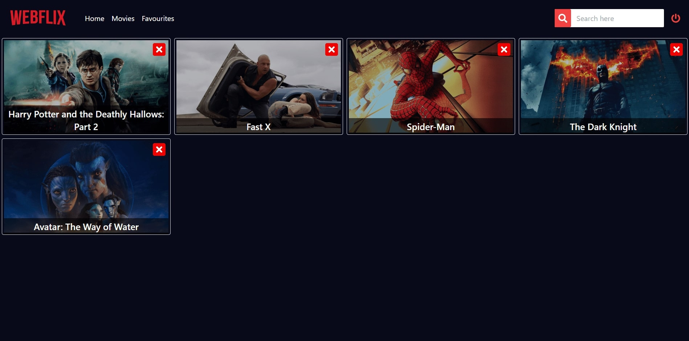

# Webflix

A clone based on Netflix consist of so many features 


## How to use

Clone the project

```bash
  git clone https://github.com/anuragsahay5/Webflix-frontend/
```

Go to the project directory

```bash
  cd client
```

Install dependencies

```bash
  npm install
```

Start the client

```bash
  npm run dev
```

## Libraries

- ``` React ``` : As the frontend javascript library to build the frontend.
- 
- - ``` React router dom ``` : Used to Navigate between pages and handle and design the flow between Login to Signp to app page.
  - 
- ``` Axios ``` : Used Axios library to make API calls to backend.

- ``` Vite ``` : Used Vite as the build tool. Much faster and developer friendly.


## Screenshots



